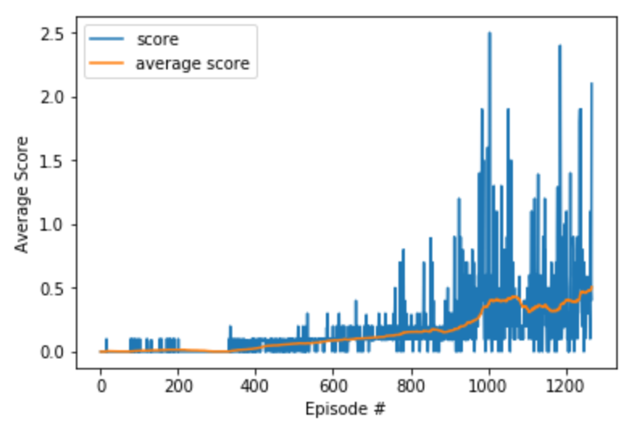

# Report

## Implementation
The environment was solved using a deep reinforcement learning agent. The implementation can be found in the [Tennis.ipynb](Tennis.ipynb) which contains
contains the rl-agents (2 in total) in the MADDPG part, and also the neural networks to implement the actor critic method. I advise you to read the report on my last projects [Navigation](Deep-Reinforcement-learning-/Navigation) and [Continuous control](Deep-Reinforcement-learning-/Continuous_control)

### Learning algorithm
[MADDPG](https://arxiv.org/abs/1706.02275) which is an actor-critic approach was used as the learning algorithm for the agent.
This algorithm is derived from [DDPG](https://arxiv.org/abs/1509.02971), but manages to solve tasks with multiple agents. You can look at the next image and pseudo-code for better understanding:

MADDPG is an off-policy algorithm and utilizes four neural networks: a local actor, a target actor, a local critic and a target critic
Each training step the experience (state, action, action_other_agent, reward, next state, next_state_other_agent) the two agents gained was stored.
Then every training step the agent learned from a random sample from the stored experience. The actor tries to estimate the
optimal policy by using the estimated state-action values from the critic while critic tries to estimate the optimal q-value function
and learns by using a normal q-learning approach. Using this approach one gains the benefits of value based and policy based
methods at the same time. **By giving the critic access to the action of the other player the learning process gets stabilized
without requiring to give the additional information** to the actor which is the only network required for acting after the
agent was trained successfully.

### Hyperparameters
The following hyperparameters were used:
* replay buffer size: 1e5
* batch size: 250
* discount factor: 0.99
* tau (soft update for target networks factor): 1e-3
* learning rate: 1e-4 (actor) 
* learning rate: 1e-3 (critic)
** OUNoise factors:  mu=0., theta=0.15, sigma=0.2

### Neural networks
The actor model is a simple feedforward network:
* Batch normalization
* Input layer: 24 (input) neurons (the state size)
* 1st hidden layer: 200 neurons (Relu)
* 2nd hidden layer: 250 neurons (Relu)
* output layer: 2 neurons (1 for each action)  (activtation: tanh)

The critic model:
* Batch normalization
* Input layer: 24 (input) neurons (the state size)
* 1st hidden layer: 200 neurons (action with 2 * action_size 2 added) (Relu)
* 2nd hidden layer: 150 neurons (Relu)
* output layer: 1 neuron

## Results
The agent was able to solve the environment **after 1267 episodes achieving an average maximum score of 0.51 over the last 100 episodes**
of the training process.

The average scores and the scores of the 2 agents during the training process:

## Possible future improvements
The algorithm could be improved in many ways such as *Prioritized Experience Replays* and by using RAINBOW on each agent 
which would improve the learning effect gained from the saved experience. 
Also from the last project, adding a layer of BatchNorm1d on the neural networks may help increase drastically the rate of learning 
